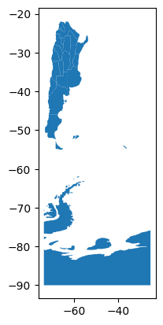
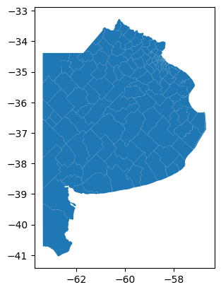
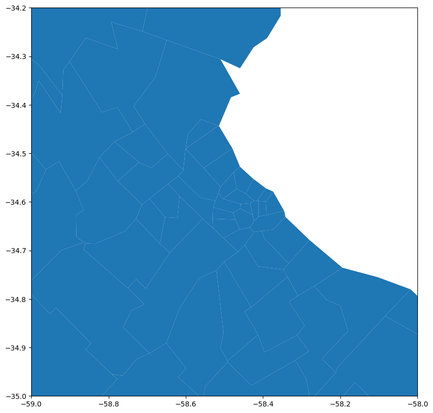

```python
import pandas as pd
import numpy as np
import folium
import geopandas as gpd
import matplotlib.pyplot as plt
%matplotlib inline

```

```python
df_places = gpd.read_file('geojson/ign_provincia.json')
df_places2=df_places[df_places['IN1']=='06']
df_places2
df_places.plot()
```


```python
df_places = gpd.read_file('geojson/departamento_3.json')
df_places2=df_places[(df_places['in1'].str.slice(0, 3)=='006') | (df_places['in1'].str.slice(0, 3)=='002')]
df_places2.plot()

```


```python
f, ax = plt.subplots(1, figsize=(10, 10))
ax = df_places2.plot(ax=ax)
ax.set_xlim([-59, -58])
ax.set_ylim([-35, -34.2])
plt.show()
```


```python
m = folium.Map(location=[-34.6, -58.4], zoom_start=11, tiles='CartoDB positron')
m.save("folium/mapa_departamental.html") 
```


```python
for _, r in df_places2.iterrows():
    # Without simplifying the representation of each borough,
    # the map might not be displayed
    sim_geo = gpd.GeoSeries(r['geometry']).simplify(tolerance=0.001)
    geo_j = sim_geo.to_json()
    if (r['in1'][0:3]=='002'):
        geo_j = folium.GeoJson(data=geo_j,
                           style_function=lambda x: {'fillColor': 'orange','fillOpacity':0.3})
    else :            
        geo_j = folium.GeoJson(data=geo_j,
                           style_function=lambda x: {'fillColor': 'green','fillOpacity':0.3})            
    folium.Popup(r['fna']).add_to(geo_j)
    geo_j.add_to(m)
m
```

```python
hsp = pd.read_csv('hospitales_coordenadas.csv',dtype=str)
hsp.head()
```

```python
for _, r in hsp.iterrows():
    lat = r['latitude']
    lon = r['longitude']
    folium.Marker(location=[lat, lon],
                  popup='Nombre: {} <br> Direccion: {}'.format(r['name'], r['label'])).add_to(m)

m
```
